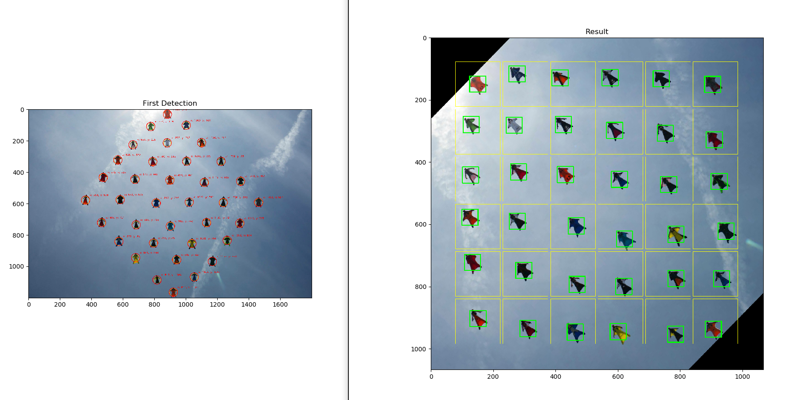
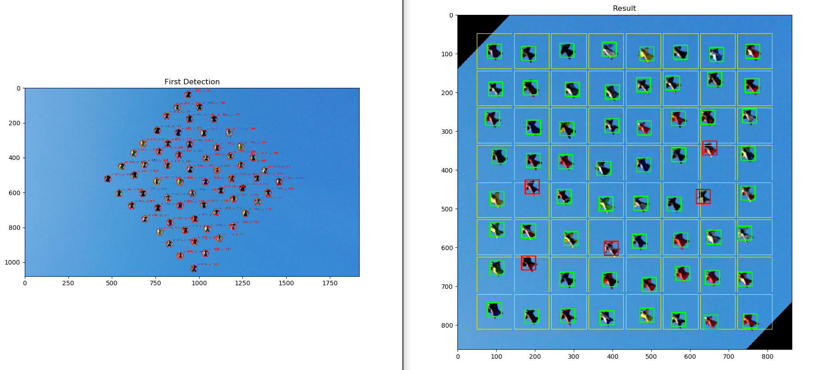

# wingsuit-jump-validator
Check if the wingsuit jump is in a valid diamond format






## Requirements:
  * Python 3.6+
  * I strongly recommend that you use a package manager like Homebrew (MacOS), apt-get (Ubuntu) and Chocolatey (Windows)

## Package Manager installation
### Homebrew (Mac)
```bash
/usr/bin/ruby -e "$(curl -fsSL https://raw.githubusercontent.com/Homebrew/install/master/install)"
```
### Update apt (Ubuntu)
```bash
sudo apt update
sudo apt upgrade
```
### Chocolatey (Windows)
```cmd
@"%SystemRoot%\System32\WindowsPowerShell\v1.0\powershell.exe" -NoProfile -InputFormat None -ExecutionPolicy Bypass -Command "iex ((New-Object System.Net.WebClient).DownloadString('https://chocolatey.org/install.ps1'))" && SET "PATH=%PATH%;%ALLUSERSPROFILE%\chocolatey\bin"
```

## Python 3.6+ with PIP
### MacOS
```bash
brew install python3
```
*[more details..](https://wsvincent.com/install-python3-mac/)
### Ubuntu
```bash
sudo apt install python3 python3-pip
```
### Windows
```cmd
choco install python3 -Y
```

## Install libraries:

```bash
pip install opencv-contrib-python numpy matplotlib scipy
```

## How to use:

### No arguments( use image 'examples/001.jpg' and 95% validation cell size ):
```bash
python validate.py
```

### 1 argument( use your own image and 95% validation cell size ):
```bash
python validate.py examples/004.jpg
```

### 2 arguments( use your own image and validation cell size ):
```bash
python validate.py examples/004.jpg 0.8
```